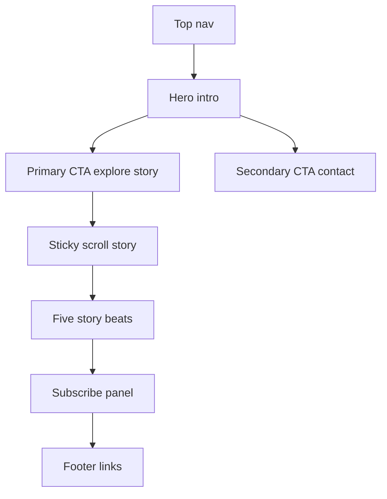

# Landing Product Design Review

Review target: `landing/`  
Review role: senior product designer  
Primary focus: whole-product experience, animation system, responsive layout, and future enhancement backlog

## Context Gathered

- The app is a standalone Next landing project with `NavBar`, `Hero`, `StoryTimeline`, `StoryBeat`, `Subscribe`, and `Footer` sections.
- The core experience is an interactive eco-story for children around Envir and Elva.
- The page already uses Framer Motion for hero entrance, scroll-linked Earth rotation, story beat reveal, and mascot floating.
- Design tokens live in `landing/app/globals.css` and a separate reference file `landing/colors_and_type.css`.
- A local dev server is already running on `http://localhost:3000`.
- I captured top-of-page screenshots into `plans/landing-desktop-top.png` and `plans/landing-mobile-top.png` for visual review.

## Clarifying Questions

1. Is this landing page primarily for children, parents, schools, sponsors, or internal demo review?
2. Should the final call to action collect email only, or should it route users to a richer action such as download, lesson plan, waitlist, or contact form?
3. Are Envir and Elva final production mascot assets, or placeholders that should be adapted into a stricter visual system?

## Current Experience Map

## Executive Assessment

The landing page has a strong, memorable concept: a scrollable eco-story where the planet visibly changes as users move through the narrative. The mascots give the product character, and the sticky Earth mechanic is the clearest interaction hook.

The biggest product-design risk is that the experience currently feels more like a polished prototype than a finished product page. The story interaction is promising, but layout resilience, mobile behavior, content hierarchy, and motion consistency need another pass before it feels production-ready.

The highest-priority issue is mobile overflow. In the mobile screenshot, the nav subscribe button is clipped, the hero paragraph overflows horizontally, the secondary CTA is cut off, and the mascots extend beyond the usable frame. This makes the first screen feel broken on a common viewport.

## Priority Todo List

- [ ] Fix mobile horizontal overflow across the nav, hero copy, CTA row, and mascot positioning.
- [ ] Rework mobile nav into a compact header pattern with one visible primary action or a menu trigger.
- [ ] Rebalance the hero layout so the characters support the message without competing with or clipping the core copy.
- [ ] Make the story timeline responsive by shifting from left-right beat placement to a single-column mobile story track.
- [ ] Add a motion system with named durations, easing, stagger rules, and reduced-motion behavior for Framer Motion animations.
- [ ] Replace repeated infinite floating animations with purposeful, state-based animation moments.
- [ ] Add story-state transitions that make healthy, polluted, turning point, and healed states feel visually distinct.
- [ ] Improve the subscribe section from a generic email box into a clearer product action with expectation-setting copy.
- [ ] Normalize source encoding and remove text artifacts in comments and user-facing copy.
- [ ] Localize or self-host external mascot image assets to improve reliability, loading behavior, and visual QA control.
- [ ] Add visual regression checks for desktop, tablet, and mobile first viewport plus mid-story and subscribe states.
- [ ] Document the design system usage so `colors_and_type.css` and `app/globals.css` do not drift apart.

## Layout Recommendations

### 1. Fix the first mobile viewport

Observed from `plans/landing-mobile-top.png`:

- The `Subscribe` nav CTA is partially off-screen.
- The hero paragraph extends beyond the viewport and gets clipped.
- `Contact Us` is clipped on the right.
- Hero mascots are cropped in a way that looks accidental.

Recommended changes:

- Use `overflow-x-hidden` at the page level as a guard, but treat it as a backstop rather than the main fix.
- Give the nav a mobile-specific layout: brand left, compact action or menu right.
- Hide secondary nav links below `sm` or collapse them into a menu.
- Make hero CTAs full-width stacked buttons on narrow screens.
- Set hero text container to `w-full max-w-[min(100%,theme-size)]` and avoid any child width that can exceed viewport.
- Size and position mascots with `clamp()` and keep them behind or below the hero content on mobile.

### 2. Reduce hero dead space on desktop

The desktop hero is visually clean, but the central content sits in a very large open field. The mascots are pushed to the lower edges, which makes the first screen feel more decorative than story-driven.

Recommended changes:

- Move mascots slightly closer to the narrative center on wide screens while preserving breathing room around the headline.
- Add a subtle mid-ground element that connects the characters to the Earth story, such as a small turning Earth, path line, or environmental prop.
- Let the first viewport reveal a hint of the story section below, so the scroll mechanic feels immediate instead of hidden.

### 3. Make the timeline mobile-first

The current alternating left-right timeline works on desktop, but it is risky on mobile because the central sticky Earth and beat cards compete for the same space.

Recommended changes:

- On mobile, use a single-column timeline with the Earth as a smaller sticky status indicator near the top.
- Keep beat cards below the sticky Earth with a clear vertical rhythm.
- Reduce `gap-[42vh]` on mobile and tune spacing per breakpoint.
- Consider a progress rail along the left edge on mobile instead of dead center.

### 4. Tighten visual hierarchy in cards

The story beat cards are readable, but the stage label, counter, title, body, bubble tail, and mascot all use similar visual weight.

Recommended changes:

- Make the stage label a small status pill or chip.
- De-emphasize the counter unless it is used for progress interaction.
- Give each beat one dominant visual cue: color, icon, or environmental state.
- Increase body text slightly for child/parent readability if the target audience includes young readers.

## Animation Recommendations

### 1. Establish a motion language

Current motion is generally pleasant, but the page mixes hero entrance, scroll-linked rotation, infinite floating, bobbing, and card reveal without a shared rule set.

Recommended motion system:

- Entrance: 500-700ms, ease out, small vertical movement.
- Interactive hover: 120-180ms, scale no higher than 1.03 for buttons.
- Story reveals: stagger card, character, and node so each beat feels authored.
- Ambient motion: slower and less frequent, reserved for characters or environmental details.
- Scroll-linked state: direct mapping to story meaning, not just decoration.

### 2. Make the Earth transformation more narrative

The rotating Earth is the strongest product idea. Right now, pollution spots and grayscale help, but the transformation could feel more emotionally legible.

Recommended enhancements:

- Add phase labels or micro-status states: healthy, polluted, hurting, hopeful, healing.
- Shift the background color tone per story phase.
- Make pollution spots appear at different thresholds instead of all sharing one opacity value.
- Add small cleanup effects near the turning point, such as particles fading, spots shrinking, or color returning in bands.
- At the final beat, trigger a short completion animation: ring pulse, leaf burst, or Earth shine.

### 3. Avoid overusing infinite motion

The hero mascots, story mascots, scroll arrow, and subscribe mascot all animate continuously. Continuous motion can become noise, especially for a child-facing page.

Recommended changes:

- Keep only one always-on motion element per viewport.
- Let story mascots animate when their beat enters view, then settle.
- Make the scroll arrow stop after the first story interaction.
- Add `useReducedMotion()` from Framer Motion so JS animations also respect reduced-motion preferences, not just CSS keyframes.

### 4. Add purposeful interaction moments

Recommended interaction ideas:

- On CTA hover, let the Earth rotate a few degrees or a leaf/water droplet icon respond.
- On story beat focus, highlight the matching timeline node and update the Earth state label.
- On subscribe success, show a mascot reaction and a clearer next action.
- Add keyboard-visible focus states that match the brand style.

## Content And Product Recommendations

### 1. Clarify the offer

The page says users can join the story, but it does not explain what subscribing gives them.

Recommended copy direction:

- State whether users receive story updates, classroom activities, eco tips, product launch news, or downloadable resources.
- Replace `Contact Us` in the hero if the destination is the same email subscribe section.
- Make the final CTA more specific, such as `Get Story Updates`, `Join the Eco Club`, or `Request Classroom Materials`.

### 2. Strengthen the story arc

The five beats are clear, but the user action is still abstract. The story ends with "you come in" but does not define what the user can do.

Recommended changes:

- Add one concrete action per story beat: save water, sort waste, plant, clean, share.
- Turn each beat into a small learning moment with one child-friendly fact or pledge.
- Add a final "what you can do today" strip before subscribe.

### 3. Improve copy polish

Source files contain text-encoding artifacts in comments and some strings. Rendered HTML resolves some em dashes, but the source should be normalized.

Recommended changes:

- Save source files as UTF-8.
- Replace encoded dash artifacts in comments and text.
- Review JSX spacing around inline spans. Server HTML shows some phrases can concatenate, such as `Envir` followed immediately by `carries`, and `tears` followed immediately by `fall`.

## Visual System Recommendations

### 1. Align token sources

There are two design-system files: `landing/colors_and_type.css` and `landing/app/globals.css`. They overlap but are not fully unified.

Recommended changes:

- Treat `colors_and_type.css` as documentation or import it intentionally.
- Keep a single canonical source for colors, type, radius, shadows, and spacing.
- Add motion tokens as part of the same system.

### 2. Balance the palette

The green and cyan brand combination works well for eco plus water. The current page leans heavily into pale green surfaces and repeated dotted patterns.

Recommended changes:

- Use cleaner section-level contrast: hero pale leaf, story neutral/sky, subscribe white/leaf, footer deep green.
- Introduce warm accent only at meaningful environmental-warning moments.
- Reduce repeated dotted pattern usage so the hero and subscribe sections do not feel like the same template repeated.

### 3. Improve asset strategy

Many important character assets load from external blob URLs. That is acceptable for a prototype, but it limits production reliability.

Recommended changes:

- Move production mascot images into `landing/public/`.
- Use `next/image` with explicit dimensions and priority only for first-viewport assets.
- Define responsive image sizes so large mascot assets do not slow down mobile.
- Keep alt text descriptive, but mark purely decorative repeated mascot images as empty-alt if they do not add new meaning.

## Accessibility Recommendations

- Add keyboard focus-visible styles for nav links, CTAs, story links, and form controls.
- Ensure animations respect reduced motion in Framer Motion, not only CSS.
- Avoid relying on color alone for story states; pair pollution/healing states with labels, icons, or shapes.
- Check heading hierarchy after any future content additions.
- Add form helper text and a clearer success state after subscription.
- Verify contrast for muted text over patterned or translucent backgrounds.

## Implementation Notes By File

- `landing/components/nav-bar.tsx`: Needs a mobile-specific navigation pattern to prevent clipping.
- `landing/components/hero.tsx`: Rework CTA wrapping, mascot positioning, and mobile text width.
- `landing/components/story-timeline.tsx`: Split desktop and mobile timeline layouts or use responsive variants for track and sticky Earth.
- `landing/components/story-beat.tsx`: Improve spacing around inline JSX fragments, reduce repeated infinite animation, and tune card hierarchy.
- `landing/components/subscribe.tsx`: Clarify CTA value and add stronger success/next-step behavior.
- `landing/app/globals.css`: Add motion tokens, improve reduced-motion coverage, and consider page-level overflow guard.
- `landing/colors_and_type.css`: Decide whether this is reference documentation or an imported design-system layer.

## Suggested Next Build Sequence

- [ ] Correct the mobile overflow in nav, hero, and CTA layout.
- [ ] Normalize text encoding and inline copy spacing.
- [ ] Add responsive timeline behavior for mobile and tablet.
- [ ] Create motion tokens and update Framer Motion animations to use consistent durations and easing.
- [ ] Add richer Earth state transitions across the five story beats.
- [ ] Improve the subscribe CTA and success state.
- [ ] Move external image dependencies into local assets and use optimized image loading.
- [ ] Add screenshot checks for desktop and mobile first viewport, mid-story, and subscribe states.

## Final Design Direction

Keep the scroll-driven Earth story. It is the strongest differentiator and gives the landing page a memorable interaction. The next iteration should make that interaction feel more authored: fewer generic floating loops, clearer story states, stronger mobile composition, and more specific user actions. Once mobile overflow is fixed and the Earth transformation becomes more expressive, the page will feel much closer to a finished child-friendly product experience.

